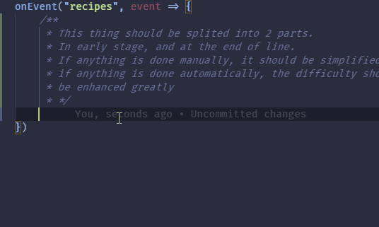
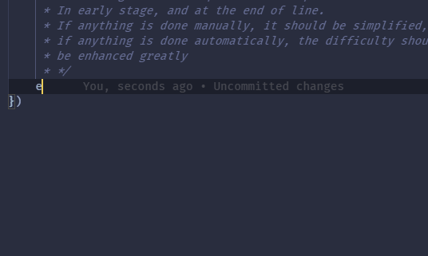

# ProbeJS

A data dumper for the KubeJS functions, constants and classes.

Currently highly WIP. But can be quite functional already:

# Installation

1. Get `npm` and `python3` (Must be python 3.9+).
2. Compile the project and place the mod into your mod directory.
3. Open the game, use `/probejs dump server` and `/kubejs export` commands in game to generate dump data (Both are needed now).
4. Paste the files inside `dump_parser` into your `.minecraft/kubejs` directory, make sure that the `declaration_compiler.py` is at the kubejs folder, and no relative topology changes.
5. With the `kubejs` folder as current working directory, run `python ./declaration_compiler.py --kube ./exported/kubejs-server-export.json --probe ./exported/probejs-server-export.json` to generate typing files.
6. Leave the folder unchanged, run `npm install ./kubetypings` to install typing files into your KubeJS directory. Maybe also `npm init -y` at the KubeJS folder to setup the package.
7. If the game content is changed, redo the step 5 to update the typing and dumps, typing files are now linked to current KubeJS directory so no need for repetitve installation.

# Event Dump

The event dump is now implemented, yay!

However, since the event is posted and captured dynamically, you still need to do as follows to generate bindings:

1. Replace all `onEvent` in your scripts to `captureEvent`, this is a event capturer implemented in ProbeJS functioning identical to the original, but with a little bit extra function - it will report to ProbeJS when the event is fired, so we can get into data of events.
2. Run the game, and use the `/probejs dump` commmand **only** after the events of interest are fired, then dump and regenerate typings as before.
3. Reload your IDE if your IDE doesn't know about the changes of typings, you will see the `onEvent` and `captureEvent` with correct typings now.
