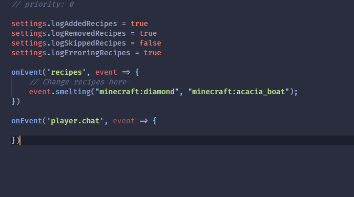

# ProbeJS

A data dumper and typing generator for the KubeJS functions, constants and classes.

Great thanks to @DAmNRelentless, @LatvianModder and @yesterday17 for invaluable suggestions during the development!

For things not dumped, or maybe if you want to add some more comments to class, methods or fields, you can add static
documents to override auto-generated typing!

ProbeJS also has builtin documents to support some other mods' recipes, but it's not completed, if you want to add
something to the document, maybe you can send a PR too!

Current progress of mod documents:

- Minecraft (Completed)
- Create (Completed)
- Integrated Dynamics (Not Completed)
- Others (Please PR)

For the detailed information, please refer to the wiki page.

## 1. Showcase

Auto-completion snippets for Items, Blocks, Fluids, Entities and Tags:

Auto-completion, type-hinting for most of the functions and classes:

## 2. Installation

1. Get VSCode.
2. Install the mod.
3. In game, use `/probejs dump` and wait for the typings to be generated.
4. Open the `./minecraft/kubejs` in VSCode, you should see snippets and typing functioning.
5. Use `/probejs dump` in case of you want to refresh the generated typing. If VSCode is not responding to file changes,
   press F1 and execute `TypeScript: Restart TS server` to force a refresh in Code.

## 3. Event Dump

1. Replace all `onEvent` in your scripts to `captureEvent`, this is a event capturer implemented in ProbeJS functioning
   identical to the original, but with a little bit extra function - it will report to ProbeJS when the event is fired,
   so we can get into data of events.
2. Run the game, and use the `/probejs dump` commmand **only** after the events of interest are fired, then dump and
   regenerate typings as before.
3. Reload your IDE if your IDE doesn't know about the changes of typings, you will see the `onEvent` and `captureEvent`
   with correct typings now.
4. If you want to remove the mod, don't forget to replace all `captureEvent` back to `onEvent`.
5. v1.4 allows dumped events to be persisted between dumps, no matter actually they're fired or not in current dump, if
   an event is missing (mostly from the removal of mods), cached events will be automatically removed too. If you want
   to clear the cache manually, use `/probejs clear_cache`.

## 4. Beaning

Bean conversions are added now, however, to make generated typing information comfort with VSCode's TS language server
while applying beaning as much as possible, a few rules are added:

1. Beans will not have naming conflicts with methods/fields existed, if a bean has a conflicted name, the bean will not
   be compiled to declaration.
2. For beans with only `.getX()` implemented, `readonly` will be automatically added to prevent coincidental writes to
   the field. For beans with any `.setX()` implemented, the bean will be able to read/write, regardless of it has
   a `.getX()` or not, as `writeonly` does not exist in TypeScript. This applies to `.isX()` beans too.
3. If `.isX()` has a `.setX()` or `.getX()` part with same name, the latter will override `.isX()` to prevent loss of
   information.
4. Original getter and setter methods are hidden, but still callable, however, calling them will not have typing support
   as these methods are ignored in method dumping.
